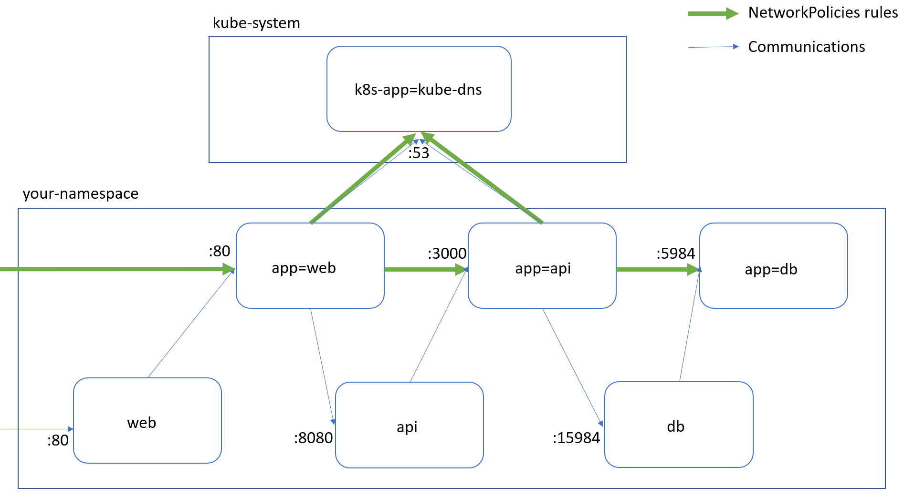

Kubernetes resources leveraged and illustrated by this blog article I wrote: [Kubernetes Network Policies, how to secure the communications between your pods](https://alwaysupalwayson.blogspot.com/2019/09/kubernetes-network-policies-how-to.html)



To summarize, here are the bash commands you need to run:
```
# Get you AKS cluster with Calico enabled
az aks create... \
  --network-policy calico

# Since we would like to allow DNS resolution from WEB and API to respectively call API and DB we need to create a Label on the kube-system Namespace
kubectl label ns kube-system name=kube-system

# Deploy WEB, API and DB Pods/Services
ns=yournamespace
kubectl create ns $ns
kubectl apply \
  -f db-api-web-deployments.yaml \
  -n $ns

# Apply the first NetworkPolicy: deny all Ingress/Egress
kubectl apply \
  -f deny-all-netpol.yaml \
  -n $ns  
 
# Apply the NetworkPolicy definition related to DB
kubectl apply \
  -f db-netpol.yaml \
  -n $ns

# Apply the NetworkPolicy definition related to API
kubectl apply \
  -f api-netpol.yaml \
  -n $ns

# Apply the NetworkPolicy definition related to WEB
kubectl apply \
  -f web-netpol.yaml \
  -n $ns
```
